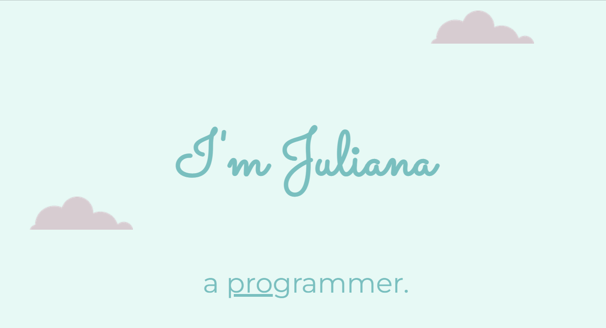

<h1> CSS - My site 🎨</h1>

 This is a personal website created using HTML 5 and CSS 3. I've created this page during the initial CSS modules in the course <a href="https://www.udemy.com/course/the-complete-web-development-bootcamp/?src=sac&kw=the+complete+2023" target="_blank">"The Complete 2023 Web Development Bootcamp"</a>  by Angela Yu.

It is one of my first projects using these languages.

This is how it looks like!

<h2>Languages used 👩🏽‍💻</h2> 
<ul>
    <li>HTML 5;</li>
    <li>CSS 3.</li>
</ul>

<h2>Skills learned 💪🏽</h2>
<ul>
    <li>CSS Static, relative and absolute positioning;</li>
    <li>CSS Box Model;</li>
    <li>CSS Display property;</li>
    <li>CSS Float and clear;</li>
    <li>Using favicons;</li>
    <li>Using HTML Divs.</li>
</ul>
